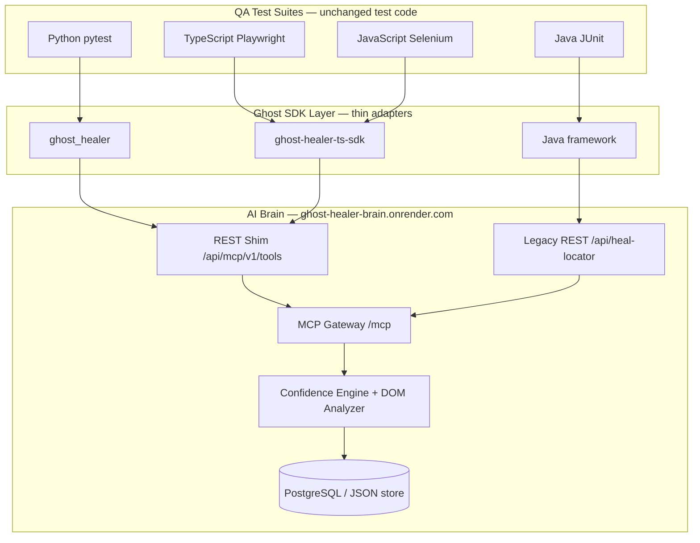
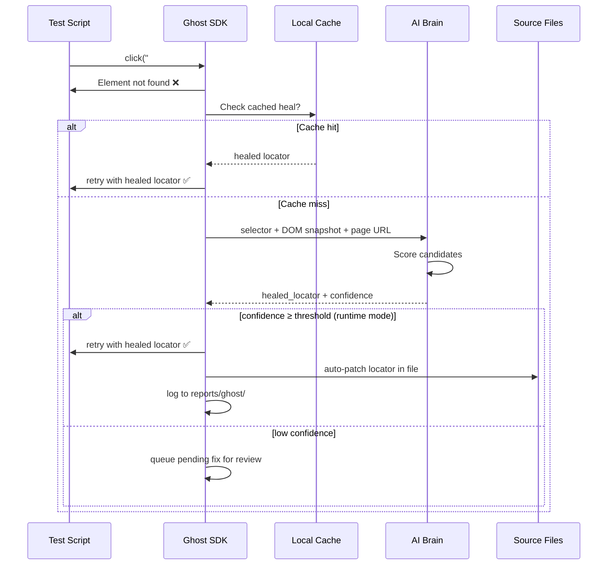

# Ghost Healer — Universal Self-Healing Framework

> **One AI Brain. Every language. Every UI automation tool. Zero locator rewrites.**

Ghost Healer is a **universal, language-agnostic self-healing layer** for UI test automation. Teams keep writing normal Playwright and Selenium tests — when the UI changes and locators break, a centralized **AI Brain** analyzes the live DOM, finds the best replacement, retries the step, and patches source code for the next run.

**→ Step-by-step usage for all languages:** [README.md](README.md)

---

## The Problem QA Teams Face Every Day

Modern UI automation breaks constantly — not because tests are poorly written, but because **the application changes faster than tests can be maintained**.

### 1. Locator fragility

| Pain | What happens in practice |
|------|--------------------------|
| **ID/class churn** | `#submit-btn` becomes `#checkout-submit-v2` after a redesign |
| **DOM restructuring** | Same button exists, but XPath hierarchy is completely different |
| **Dynamic attributes** | `data-testid` removed, replaced with auto-generated classes |
| **Shadow DOM / iframes** | Locators that worked in one release fail silently in the next |

**Impact:** Tests fail for the wrong reason — the feature works, the locator doesn't.

### 2. Maintenance tax

- QA engineers spend **30–50% of sprint time** updating selectors instead of writing new coverage
- Every UI deploy creates a **locator fire drill** across dozens of test files
- Page Object Models grow into **unmaintainable locator encyclopedias**
- Knowledge silos: only one person knows why `#address` was chosen six months ago

### 3. Flaky tests erode trust

- Intermittent locator failures get labeled "flaky" and **muted or skipped**
- Real regressions hide behind noise
- CI pipelines turn red on **cosmetic UI changes**, not functional bugs
- Teams retry suites blindly (`--retries 3`) instead of fixing root cause

### 4. Multi-framework, multi-language chaos

Enterprise QA rarely runs a single stack:

| Team | Stack |
|------|-------|
| Frontend QA | Playwright + TypeScript |
| Legacy services | Selenium + Java |
| API + UI integration | Python + pytest |
| Contract / smoke | JavaScript + Mocha |

Each stack traditionally needs **its own healing approach** — or no healing at all. Fixes don't transfer. Learning doesn't scale.

### 5. No feedback loop

When a locator is fixed manually:

- The fix is **not shared** across teams or projects
- The same breakage **recurs** on the next redesign
- There is no **confidence score** — was this guess or evidence?
- Audit trails are missing — who changed what, and why?

---

## How Ghost Healer Solves These Problems

Ghost Healer treats locator healing as a **platform capability**, not a per-test patch job.

### Solution map

| QA problem | Ghost Healer response |
|------------|----------------------|
| Locator breaks after UI change | Runtime intercept → DOM snapshot → AI similarity match → retry with healed locator |
| Manual selector maintenance | Optional **auto-patch** writes the healed locator back to your source file |
| Flaky failures on good features | Confidence scoring — only auto-heal when evidence is strong; queue low-confidence fixes for review |
| Multiple languages / tools | **One Brain**, thin SDK per language — same healing pipeline everywhere |
| No audit trail | Every heal logged to `reports/ghost/` with old/new locator, confidence, timestamp |
| Expensive Brain setup per team | **Install-only SDK access** — `npm install` or `pip install`, no API key ceremony |
| Tests must be rewritten | **Zero-change activation** — hooks intercept at runtime; test logic stays identical |

### What QA keeps doing

```text
Write normal tests → Run CI → Move on
```

### What Ghost does in the background

```text
Detect failure → Capture DOM → Ask Brain → Retry → Patch source → Log report
```

---

## Why It Is Universal

"Universal" means three things in Ghost Healer:

### 1. Universal across **automation tools**

| Tool | Supported | How |
|------|-----------|-----|
| **Playwright** | ✅ | Runtime hooks on `Page` / `Locator` (TS/JS/Python/Java) |
| **Selenium** | ✅ | WebDriver interception, JUnit extension, pytest fixture wrap |

Same Brain endpoint. Same confidence engine. Same report format.

### 2. Universal across **languages**

| Language | Package / path | Playwright | Selenium |
|----------|----------------|:----------:|:--------:|
| Python | `pip install ghost-healer` | ✅ | ✅ |
| TypeScript | `npm install ghost-healer-ts-sdk` | ✅ | ✅ |
| JavaScript | `npm install ghost-healer-ts-sdk` | ✅ | ✅ |
| Java | `ghost_healer/framework/java/` | ✅ | ✅ |

**Eight combinations. One healing contract.**

### 3. Universal **Brain** (single source of truth)

All SDKs call the same **AI Brain** — a centralized FastAPI + MCP service that:

- Parses DOM snapshots
- Extracts semantic features (text, role, attributes, structure, visibility)
- Scores candidate locators with a weighted confidence engine
- Returns `AUTO_HEAL`, `MANUAL_REVIEW`, or `FAIL`
- Persists heals for analytics and adaptive learning

No per-language healing logic duplicated in tests. Intelligence lives in one place.

---

## Architecture

### High-level system view



### Design principles

| Principle | Implementation |
|-----------|----------------|
| **MCP-first** | Brain exposes MCP tools; SDKs call REST shim for broad compatibility |
| **Zero-change tests** | SDKs use runtime hooks, pytest plugins, JUnit extensions — not locator wrappers in test code |
| **Install-only access** | Built-in SDK public key; Brain accepts `GHOST_SDK_PUBLIC_KEY` — no per-developer secrets |
| **Deferred + runtime healing** | TS/JS Playwright: record failures during suite, batch-heal in teardown; also supports immediate retry |
| **Human in the loop** | `suggestion` / `approval` modes queue fixes; `ghost-healer review` for governance |
| **Tenant isolation** | `X-Ghost-Tenant` / `X-Ghost-Project` headers scope analytics per team |

---

## Component Breakdown

### AI Brain (`mcp-server/`)

The Brain is the **only place** healing intelligence lives.

| Module | Role |
|--------|------|
| `mcp_gateway/` | MCP tool definitions (`heal_locator`, `health_check`, …) |
| `ai_engine/` | DOM parsing, feature extraction, similarity scoring |
| `services/healing_service.py` | Orchestrates pipeline end-to-end |
| `middleware/auth.py` | API key + SDK public key auth |
| `utils/db_manager.py` | PostgreSQL (Render) or JSON fallback |

**Demo instance (short-term):** `https://ghost-healer-brain.onrender.com`  
**Self-host:** Anyone can fork the repo, deploy their own Brain on Render, and publish their own SDKs — see [docs/SELF_HOST_AND_PUBLISH.md](docs/SELF_HOST_AND_PUBLISH.md).

### SDK / Adapter Layer

SDKs are **thin clients**. They do not embed AI models.

| Responsibility | Owner |
|----------------|-------|
| Intercept locator failure | SDK adapter |
| Capture DOM / page URL | SDK adapter |
| Call Brain API | SDK adapter |
| Retry step / patch file | SDK adapter |
| Decide best locator | **Brain only** |

| SDK | Location | Activation |
|-----|----------|------------|
| Python | `ghost_healer/` | pytest entry point + `autoload` |
| TypeScript / JS | `sdk/ts/` → npm `ghost-healer-ts-sdk` | `NODE_OPTIONS` + `auto-activate.js` |
| Java | `ghost_healer/framework/java/` | JUnit 5 `@ExtendWith` or javaagent |

---

## Healing Lifecycle



### Healing modes

| Mode | QA use case |
|------|-------------|
| `runtime` | Dev + CI — heal and retry immediately; patch source |
| `suggestion` | CI gate — log proposed fix, don't auto-retry |
| `approval` | Regulated environments — human must approve before apply |
| `strict` | Release gate — only very high-confidence heals |

---

## Real-World Scenario

**Before Ghost Healer**

```text
Day 1:  Checkout test passes (#address field)
Day 2:  Dev renames field → #shipping-address
Day 3:  14 tests fail in CI
Day 4:  QA hunts locators across 6 files
Day 5:  PR merged — 2 locators still wrong in Selenium suite
Day 6:  Sprint spillover — no new test coverage
```

**With Ghost Healer**

```text
Day 1:  Checkout test passes
Day 2:  Dev renames field → first run records failure
Day 2:  Ghost Brain heals #address → #shipping-address, patches source
Day 2:  Second run passes — all 14 tests green
Day 3:  QA writes new tests instead of fixing old locators
```

---

## Enterprise Fit

| Concern | Ghost Healer approach |
|---------|----------------------|
| **No secrets in repos** | Built-in SDK key; optional `GHOST_API_KEY` for private Brain |
| **Multi-team analytics** | Tenant / project headers on every heal request |
| **Governance** | Pending-fix queue + `ghost-healer review` CLI |
| **CI/CD** | `pip install` / `npm install` — no manual Render key copy |
| **Self-host** | Deploy Brain via `render.yaml` or Docker; SDKs point to your URL |
| **Observability** | `reports/ghost/`, confidence report API, heal feedback loop |

---

## Repository Map

```text
MCP_CLIENT_SERVER_PROJECT/
├── FRAMEWORK.md          ← You are here — architecture & QA problem/solution
├── README.md             ← Step-by-step usage (all 8 language × tool combos)
├── mcp-server/           ← AI Brain (FastAPI + MCP)
├── ghost_healer/         ← Python SDK
├── sdk/ts/               ← TypeScript / JavaScript SDK (npm)
├── ghost_healer/framework/java/  ← Java SDK
├── demo/                 ← Working examples (8 combinations)
└── docs/                 ← Deep-dive guides
```

---

## Documentation

| Document | Audience |
|----------|----------|
| [README.md](README.md) | QA engineers — install & run per language/tool |
| [docs/SELF_HOST_AND_PUBLISH.md](docs/SELF_HOST_AND_PUBLISH.md) | **Fork, deploy Brain, publish SDKs** |
| [docs/ZERO_CHANGE_INSTALL.md](docs/ZERO_CHANGE_INSTALL.md) | Quick install matrix |
| [docs/architecture.md](docs/architecture.md) | Technical component reference |
| [docs/DEPLOY_COMPLETE.md](docs/DEPLOY_COMPLETE.md) | DevOps — deploy Brain to Render |
| [docs/enterprise_usage.md](docs/enterprise_usage.md) | Platform / governance teams |
| [demo/README.md](demo/README.md) | Hands-on demos |

---

## Summary

| Question | Answer |
|----------|--------|
| What is Ghost Healer? | Universal self-healing platform for UI test automation |
| Who is it for? | QA teams using Playwright or Selenium in any supported language |
| What problem does it solve? | Locator breakage, maintenance tax, flaky CI, multi-stack fragmentation |
| How is it universal? | One Brain, eight SDK paths, zero test rewrites |
| How do I use it? | [README.md](README.md) — install SDK, run existing tests |

---

**Ghost Healer — stop fixing locators manually. Let the Brain heal your suites.**
