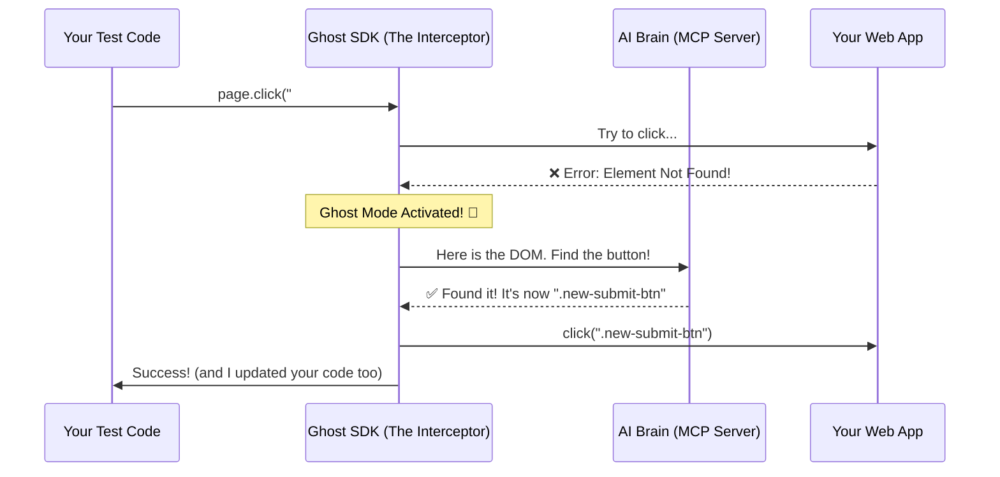

# 👻 Ghost Healer: Tests That Fix Themselves
### **The world's first language-agnostic, zero-refactor AI self-healing automation platform.**

[](https://badge.fury.io/py/ghost-healer)
[](https://www.docker.com/)
[](https://opensource.org/licenses/MIT)

---

## 😫 Why did we build this?
**Let's be honest: Automation maintenance is a nightmare.**
You spend hours writing a perfect test suite, only for a developer to rename a button ID or move a login field. Suddenly, half your tests are red. You spend the next day manually updating locators instead of building new features.

**Ghost Healer was built to kill the "Maintenance Tax."** It provides a smart, invisible safety net that catches your test failures, fixes them using AI, and even updates your code for you.

---

## ✨ What is Ghost Healer?
Ghost Healer is an **AI-powered middleware**. It sits between your automation script (Playwright, Selenium, etc.) and the browser. 

- **If your locator works**: Ghost Healer stays silent and invisible.
- **If your locator breaks**: Ghost Healer's "Ghost Mode" activates, finds the element using AI, completes the action, and **permanently fixes your source code** so it doesn't break again.

---

## 🚀 How to use it (3 Simple Steps)

### 1. Install the SDK
```bash
pip install ghost-healer
```

### 2. Start the "AI Brain" (MCP Server)
The Brain is a centralized server that handles the healing logic. Launch it with Docker:
```bash
cd mcp-server
docker-compose up -d
```

### 3. Protect your Project
Run this command in your automation folder to bootstrap the configuration:
```bash
ghost-healer init
```
**That's it!** Your tests are now protected by AI. No need to change your existing `page.click()` or `driver.findElement()` calls.

---

## 🛠️ How it Works (The Magic)



---

## 🏛️ Project Architecture
We designed Ghost Healer to be **Distributed** and **Language-Agnostic**.

### 1. The SDK (`ghost_healer/`)
This is what you install in your test project. It contains:
- **Adapters**: Special logic for Playwright and Selenium.
- **Framework Bridges**: Ready-to-use wrappers for **Java** and **TypeScript** (`ghost_healer/framework/`).
- **SourceHealer**: The engine that reaches into your `.py`, `.java`, or `.ts` files to fix locators.

### 2. The Brain (`mcp-server/`)
The centralized AI server. It's built with **FastAPI** and uses "Structural DNA Matching" to identify moved or renamed elements even when IDs change.

---

## 🗺️ Roadmap
- [x] **Python + Playwright**: Stable Release
- [x] **Automatic Source Code Patching**: Available (Py, Java, TS)
- [x] **Selenium Java Adapter**: **Available (Beta)**
- [x] **TypeScript Playwright Adapter**: **Available (Beta)**
- [ ] **Coming Soon**: Visual AI Healing (Computer Vision fallback)
- [ ] **Coming Soon**: Automated Git PRs for locator fixes
- [ ] **Coming Soon**: Support for Cypress & Appium

---

## 🛡️ License
Distributed under the MIT License. See `LICENSE` for more information.

**Stop fighting your locators. Start trusting your tests.** 🛡️🌍🏆✨
