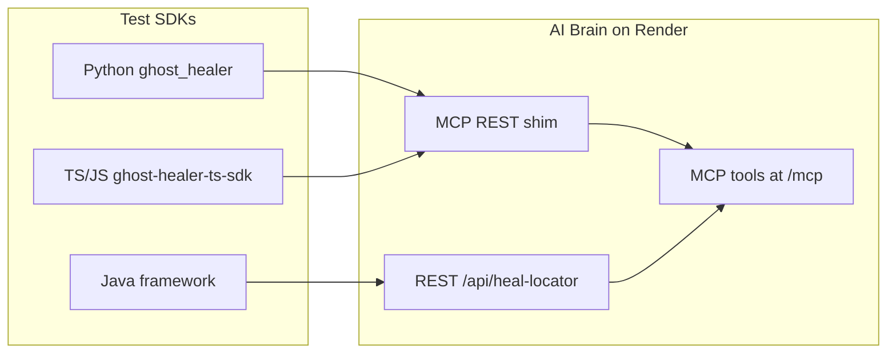

# Ghost Healer: Universal AI Self-Healing Automation Platform

> **🏗️ Architecture, QA problems & universal framework design → [FRAMEWORK.md](FRAMEWORK.md)**  
> *(Problem statement, how Ghost Healer solves real QA pain, MCP Brain architecture, and why it works across all languages and tools.)*

Language-agnostic, zero-refactor self-healing for **Playwright** and **Selenium** across **Python, TypeScript, JavaScript, and Java**.

**Install the SDK → run your existing tests.** No API key. No login. No locator rewrites.

> **⚠️ Demo Brain notice:** The default hosted Brain (`ghost-healer-brain.onrender.com`) is a **short-term demo** on Render free tier. For production or long-term use, **clone this repo → deploy your own Brain → publish your own SDKs** (or point SDKs at your Brain URL). Full guide: **[docs/SELF_HOST_AND_PUBLISH.md](docs/SELF_HOST_AND_PUBLISH.md)**

---

## What It Does

- Intercepts locator failures at runtime
- Sends DOM snapshots to the **AI Brain** for similarity-based matching
- Retries failed steps with healed locators when confidence is high enough
- Optionally patches source files on disk (`runtime` mode)
- Records heals in `reports/ghost/` for audit and feedback

---

## Self-Host & Publish Your Own Stack

**Yes — anyone can run Ghost Healer independently.** You are not locked to the demo Brain.

| Goal | What to do |
|------|------------|
| **Try healing quickly** | `npm install ghost-healer-ts-sdk` → run tests (uses demo Brain) |
| **Host your own Brain** | Fork repo → deploy `render.yaml` on **your** Render account |
| **Publish your own SDKs** | Update `builtin-access.json` + credentials → `npm publish` / `twine upload` |
| **End users** | Install **your** package → run tests (no Brain setup) |

### Path A — Self-host Brain only (fastest)

Keep public npm/PyPI packages; point them at your Brain:

```bash
# 1. Clone & deploy Brain on your Render (Blueprint → render.yaml)
git clone https://github.com/MansoonMangal/MCP_GHOST_HEALER.git

# 2. On Render: set GHOST_SDK_PUBLIC_KEY = gh_sdk_public_8f4a2c9e1b7d3f6a0e5c8b2d4f7a1e9
#    (same as published SDK — so existing packages work)

# 3. In your test project .env:
GHOST_BRAIN_URL=https://YOUR-BRAIN-URL.onrender.com
```

Then `npm install ghost-healer-ts-sdk` or `pip install ghost-healer` and run tests.

### Path B — Fork + publish your own SDKs (full ownership)

```text
Fork repo
  → Generate your GHOST_SDK_PUBLIC_KEY
  → Update sdk/ts/builtin-access.json + Python/Java credentials
  → Deploy Brain on your Render (render.yaml)
  → npm publish (sdk/ts) + twine upload (Python)
  → Users: npm install @your-org/ghost-healer-ts-sdk && pytest / playwright test
```

**Step-by-step:** [docs/SELF_HOST_AND_PUBLISH.md](docs/SELF_HOST_AND_PUBLISH.md)

### What you own vs what end users do

| You (host/publisher) | End user (QA engineer) |
|----------------------|------------------------|
| Render account + Brain deploy | `npm install` or `pip install` |
| `GHOST_API_KEY` + `GHOST_SDK_PUBLIC_KEY` on Render | Run existing tests — no keys |
| Publish npm / PyPI (optional) | No Render access needed |
| Update `brain_url` in SDK (Path B) | No `.env` if SDK is pre-configured |

---

## Supported Matrix

| Language | Playwright | Selenium |
|----------|:----------:|:--------:|
| **Python** | ✅ pytest plugin | ✅ auto fixture wrap |
| **TypeScript** | ✅ auto-activate | ✅ auto-activate |
| **JavaScript** | ✅ auto-activate | ✅ auto-activate |
| **Java** | ✅ `GhostPlaywright.protect()` | ✅ JUnit 5 extension |

---

## How to Use — Step by Step (Every Language × Tool)

All combinations use **install-only Brain access** — the SDK ships a built-in key and provisions `~/.ghost/credentials.json` automatically.

### Healing flow (all languages)

| Run | What happens |
|-----|----------------|
| **1st run** | Broken locator may still fail (failure is recorded) |
| **After suite** | Ghost calls the Brain and patches your source files |
| **2nd run** | Healed locator is used — test should pass |

---

### 1. Python + Playwright

**Install**

```bash
pip install ghost-healer
```

**Run** — no changes to test files or `conftest.py`:

```bash
pytest
```

The pytest plugin auto-wraps the `page` fixture when `pytest-playwright` is installed.

**Example test** (write as normal):

```python
def test_login(page):
    page.goto("https://example.com")
    page.locator("#submit").click()
```

**Verify (optional):** `ghost-healer doctor`

**Detailed guide:** [docs/PYTHON_USAGE.md](docs/PYTHON_USAGE.md)

---

### 2. Python + Selenium

**Install**

```bash
pip install ghost-healer
```

**Run:**

```bash
pytest
```

The pytest plugin auto-wraps Selenium fixtures: `driver`, `browser`, `webdriver`, `selenium_driver` (configurable in `ghost.yaml`).

**Example test** (write as normal):

```python
def test_search(driver):
    driver.get("https://example.com")
    driver.find_element("id", "search-btn").click()
```

**Verify (optional):** `ghost-healer doctor`

**Detailed guide:** [docs/PYTHON_USAGE.md](docs/PYTHON_USAGE.md)

---

### 3. TypeScript + Playwright

**Install** (in your Playwright project root):

```bash
npm install ghost-healer-ts-sdk
```

On install the SDK adds `NODE_OPTIONS=--require ghost-healer-ts-sdk/auto-activate` to `.env` and injects hooks + `globalSetup`/`globalTeardown`. **Do not edit `playwright.config.ts`.**

**Run:**

```bash
npx ghost-playwright test
# or
npx playwright test
```

**Recommended `package.json` scripts:**

```json
{
  "scripts": {
    "test": "ghost-playwright test",
    "test:headed": "ghost-playwright test --headed"
  }
}
```

**Verify (optional):** `npx ghost-healer doctor`

**Detailed guide:** [docs/PLAYWRIGHT_TS_USAGE.md](docs/PLAYWRIGHT_TS_USAGE.md)

---

### 4. TypeScript + Selenium

**Install:**

```bash
npm install ghost-healer-ts-sdk selenium-webdriver
```

`postinstall` sets `NODE_OPTIONS` — Selenium `findElement` hooks load when `selenium-webdriver` is present.

**Run:**

```bash
npm test
# or your Mocha/Jest runner — NODE_OPTIONS activates Ghost automatically
```

**Verify (optional):** `npx ghost-healer doctor`

**Detailed guide:** [docs/PLAYWRIGHT_TS_USAGE.md](docs/PLAYWRIGHT_TS_USAGE.md) (same npm package)

---

### 5. JavaScript + Playwright

Same package and flow as TypeScript.

**Install:**

```bash
npm install ghost-healer-ts-sdk
```

**Run:**

```bash
npx ghost-playwright test
```

**Verify (optional):** `npx ghost-healer doctor`

**Detailed guide:** [docs/JAVASCRIPT_USAGE.md](docs/JAVASCRIPT_USAGE.md)

---

### 6. JavaScript + Selenium

**Install:**

```bash
npm install ghost-healer-ts-sdk selenium-webdriver
```

**Run:**

```bash
npm test
```

**Verify (optional):** `npx ghost-healer doctor`

**Detailed guide:** [docs/JAVASCRIPT_USAGE.md](docs/JAVASCRIPT_USAGE.md)

---

### 7. Java + Playwright

**Setup** — add classes from `ghost_healer/framework/java/` to your test classpath (see `demo/pw-java/`).

**Wire once** in your test base class:

```java
import com.ghosthealer.core.GhostPlaywright;
import com.microsoft.playwright.Page;

@BeforeEach
void setUp() {
    page = GhostPlaywright.protect(
        playwright.chromium().launch().newPage()
    );
}
```

**Run:**

```bash
mvn test
```

Brain access is automatic — `GhostCredentials` provisions the built-in SDK key on first class load.

**Detailed guide:** [docs/JAVA_USAGE.md](docs/JAVA_USAGE.md)

---

### 8. Java + Selenium

**Setup** — add classes from `ghost_healer/framework/java/` to your test classpath.

**Option A — One annotation on base test (recommended):**

```java
import org.junit.jupiter.api.extension.ExtendWith;
import com.ghosthealer.core.GhostHealerExtension;
import com.ghosthealer.core.GhostDriver;

@ExtendWith(GhostHealerExtension.class)
public class BaseTest {

    @GhostDriver
    protected WebDriver driver;

    @BeforeEach
    void setUp() {
        driver = new ChromeDriver();
    }
}
```

Subclass tests need **no Ghost imports** — all `findElement` calls are auto-healed.

**Option B — Javaagent (zero annotations):**

```bash
export JAVA_TOOL_OPTIONS="-javaagent:path/to/ghost-healer-agent.jar"
mvn test
```

**Run:**

```bash
mvn test
```

**Detailed guide:** [docs/JAVA_USAGE.md](docs/JAVA_USAGE.md)

---

## Quick Reference Table

| # | Language | Tool | Install | Run | Edit tests? |
|---|----------|------|---------|-----|-------------|
| 1 | Python | Playwright | `pip install ghost-healer` | `pytest` | No |
| 2 | Python | Selenium | `pip install ghost-healer` | `pytest` | No |
| 3 | TypeScript | Playwright | `npm i ghost-healer-ts-sdk` | `npx ghost-playwright test` | No |
| 4 | TypeScript | Selenium | `npm i ghost-healer-ts-sdk selenium-webdriver` | `npm test` | No |
| 5 | JavaScript | Playwright | `npm i ghost-healer-ts-sdk` | `npx ghost-playwright test` | No |
| 6 | JavaScript | Selenium | `npm i ghost-healer-ts-sdk selenium-webdriver` | `npm test` | No |
| 7 | Java | Playwright | Add `framework/java` to classpath | `mvn test` | One `protect()` line |
| 8 | Java | Selenium | Add `framework/java` to classpath | `mvn test` | One `@ExtendWith` on base |

**No API key. No login. No `.env` secrets** for the hosted Brain.

---

## What You Never Need to Do

| Do not… | Why |
|---------|-----|
| Copy `GHOST_API_KEY` from Render | SDK has built-in access |
| Run `ghost-healer login` | Optional — only for private Brain |
| Rewrite locators in tests | Hooks intercept failures |
| Add locator wrapper classes | Adapters patch at runtime |
| Edit Playwright config (TS/JS) | Auto-injected via `NODE_OPTIONS` |

---

## Verify Setup (optional)

```bash
npx ghost-healer doctor    # TypeScript / JavaScript
ghost-healer doctor        # Python
```

Expected:

```text
Access     : SDK built-in (install-only)
API key    : configured ✓
Brain      : healthy ✓
```

---

## Optional Configuration

`ghost.yaml` at project root is **not required**. Use it for custom thresholds or healing mode:

```yaml
mcp_server:
  url: "https://ghost-healer-brain.onrender.com"
  confidence_threshold: 0.5

healing:
  mode: "runtime"    # runtime | suggestion | approval | strict
  auto_patch: true
  cache_enabled: true

reporting:
  output_dir: "reports/ghost"
```

### Healing modes

| Mode | Behavior |
|------|----------|
| `runtime` | Heal + retry; optional auto-patch to source files |
| `suggestion` | Suggest heal; queue for review; no auto-retry |
| `approval` | Same as suggestion; review via `ghost-healer review` |
| `strict` | Only very high-confidence heals applied |

---

## Architecture



| Layer | Location | Role |
|--------|----------|------|
| SDK / adapters | `ghost_healer/`, `sdk/ts/`, `ghost_healer/framework/java/` | Auto-activation, interceptors, reporting |
| AI Brain | `mcp-server/` | FastAPI + MCP gateway, healing pipeline, storage |
| Config | `ghost.yaml` (optional) | Thresholds, healing mode, tenant/project |

---

## Demos

Working examples for all eight combinations: [demo/README.md](demo/README.md)

---

## Documentation Index

| Doc | Contents |
|-----|----------|
| **[SAFE_HEALING_DEMO.md](docs/SAFE_HEALING_DEMO.md)** | Avoid cascading bad patches; safe demo scenarios |
| **[SELF_HOST_AND_PUBLISH.md](docs/SELF_HOST_AND_PUBLISH.md)** | Clone → deploy Brain on Render → publish your own SDKs |
| **[FRAMEWORK.md](FRAMEWORK.md)** | **Architecture, QA problems, universal design, how it solves real-world pain** |
| [ZERO_CHANGE_INSTALL.md](docs/ZERO_CHANGE_INSTALL.md) | Master install guide |
| [PLAYWRIGHT_TS_USAGE.md](docs/PLAYWRIGHT_TS_USAGE.md) | Playwright + TypeScript |
| [JAVASCRIPT_USAGE.md](docs/JAVASCRIPT_USAGE.md) | Playwright/Selenium + JavaScript |
| [PYTHON_USAGE.md](docs/PYTHON_USAGE.md) | Playwright/Selenium + Python |
| [JAVA_USAGE.md](docs/JAVA_USAGE.md) | Playwright/Selenium + Java |
| [DEPLOY_COMPLETE.md](docs/DEPLOY_COMPLETE.md) | Deploy Brain to Render |
| [enterprise_usage.md](docs/enterprise_usage.md) | CI/CD, governance, private Brain |

---

## AI Brain (self-host)

The demo Brain is temporary. **Deploy your own** on Render (recommended) or run locally:

```bash
cd mcp-server
pip install -r requirements.txt
python -m uvicorn app.main:app --host 0.0.0.0 --port 8000
```

- **Full self-host + SDK publish:** [docs/SELF_HOST_AND_PUBLISH.md](docs/SELF_HOST_AND_PUBLISH.md)
- **Render deploy troubleshooting:** [docs/DEPLOY_COMPLETE.md](docs/DEPLOY_COMPLETE.md)

---

## Project Structure

```text
MCP_CLIENT_SERVER_PROJECT/
├── ghost_healer/                 # Python SDK + pytest plugin
├── sdk/ts/                       # npm: ghost-healer-ts-sdk
├── ghost_healer/framework/java/  # Java client + JUnit extension
├── mcp-server/                   # AI Brain (FastAPI + MCP)
├── demo/                         # Examples (all 8 combinations)
├── docs/                         # Per-language usage guides
└── scripts/                      # release_gate.py, verify_slo.py
```

---

## Development

```bash
python -m pytest mcp-server/tests/ tests/ -v
python scripts/release_gate.py --stage beta
```

---

Stop fixing locators manually — install Ghost Healer and let the Brain heal your suites.
