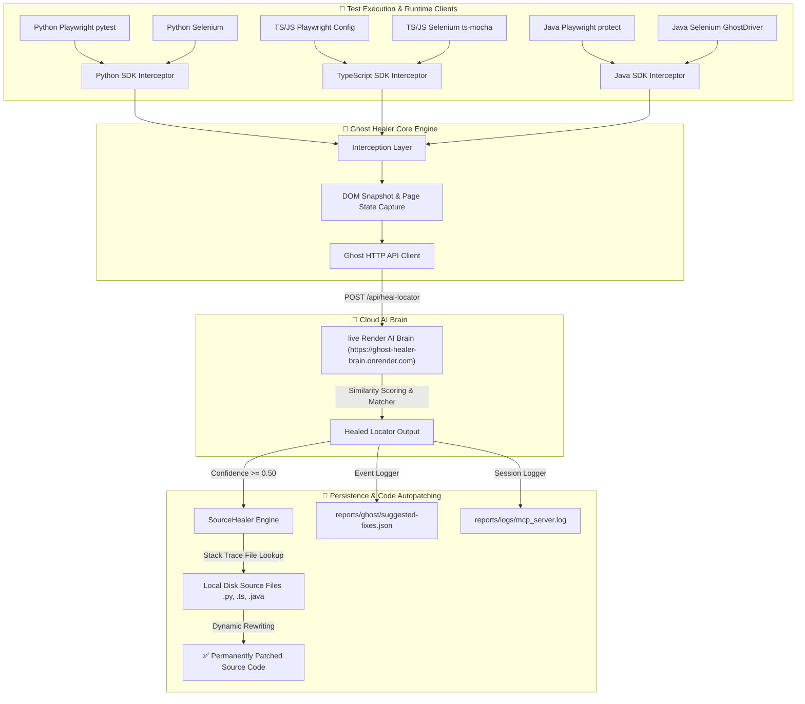

# 👻 Ghost Healer: Universal AI Self-Healing Automation Platform

### **The world's first language-agnostic, zero-refactor AI self-healing automation platform.**

> [!NOTE]
> **Complete Implementation Steps**: If you want to know the complete, step-by-step instructions on how to implement and integrate Ghost Healer, please see the detailed [demo/README.md](file:///c:/Users/mansoon.mangal.ASCENDION/OneDrive%20-%20ascendion/Desktop/API%20-%20My%20Work/MCP_CLIENT_SERVER_PROJECT/demo/README.md).

---

## ⚡ Why We Developed Ghost Healer (The Problem)

Modern web development moves at supersonic speeds. Elements change classes, text contents are rephrased, and HTML structures are reorganized daily. For Quality Engineering and SDET teams, this introduces three critical challenges:

> [!WARNING]
> ### 1. The Maintenance Vortex
> QA engineers spend **up to 40% of their weekly capacity** manually triaging failed CI/CD pipelines, only to realize the failure was caused by a changed class name, ID, or structure rather than a real application bug.
> 
> ### 2. Test Suite Flakiness
> Brittle XPath and CSS locators cause builds to randomly fail. A flake in one pipeline delays deployment, reduces developer trust in automation, and blocks continuous delivery.
> 
> ### 3. Cross-Language Fragmentation
> Most automated self-healing solutions are tool-specific or language-specific. A company using Python Playwright for API testing, TypeScript for web UI, and Java Selenium for legacy flows has to configure three separate healing solutions, none of which talk to each other.

---

## 💡 How Ghost Healer Makes Things Easy (The Solution)

Ghost Healer is designed from the ground up to solve these maintenance and flakiness pain points seamlessly:

* **Zero Test Refactoring**: You do not need to change a single line of test code, assertions, or your Page Object Model (POM) pattern. It intercepts failures under the hood.
* **Auto-Patching to Local Disk**: It doesn't just bypass the issue during execution; it traces the execution stack, finds the exact test source file (`.py`, `.ts`, `.java`), and **permanently overwrites the broken locator string on disk**.
* **Language & Framework Parity**: A single configuration and unified AI Brain interface support all **8 core combinations** of **Playwright & Selenium** across **Python, Java, TypeScript, and JavaScript**.
* **Centralized Reporting**: Every single heal action is cataloged in a beautiful JSON report [reports/ghost/suggested-fixes.json](file:///c:/Users/mansoon.mangal.ASCENDION/OneDrive%20-%20ascendion/Desktop/API%20-%20My%20Work/MCP_CLIENT_SERVER_PROJECT/reports/ghost/suggested-fixes.json), creating a transparent audit trail for your engineering teams.

---

## 🎨 System Architecture & Project Blueprint

Ghost Healer integrates a lightweight local adapter system with a high-performance centralized AI Brain:



---

## 🛠️ Complete Framework Architecture in Detail

The Ghost Healer platform operates across four primary integrated architectural layers:

### 1. The Interception Layer (Language & Driver Adapters)
Rather than introducing custom locator subclasses or requiring test re-authoring, Ghost Healer integrates directly at the runtime or driver prototype level:
* **Python Interceptor (`ghost_healer/adapters/`)**: Hooked using dynamic overrides of standard Playwright actions (like `.locator()`, `.click()`, `.fill()`) and Selenium's standard `WebDriver.find_element` function. If standard execution triggers a `NoSuchElementException` or `TimeoutError`, the failure event is seamlessly caught by Ghost Healer.
* **TypeScript & JavaScript Interceptor (`sdk/ts/src/`)**: Built on JavaScript runtime prototype patching and Proxy traps. Overrides the prototype methods of Playwright's `Page` and `Locator` objects, and overrides the main class methods of Selenium's `WebDriver` and `WebElement` classes, ensuring 100% zero-code-change enablement.
* **Java Interceptor (`ghost_healer/framework/java/`)**: Implemented using Java's standard reflection framework and `java.lang.reflect.Proxy` dynamic proxy classes. Playwright's native interface is wrapped in a dynamic handler, while Selenium tests utilize JUnit 5 extensions (`GhostHealerExtension`) combined with `@GhostDriver` injection hooks.

### 2. Context Capture & Diagnostic Layer
When an adapter intercepts a locator error:
1. It immediately halts the test exception from reaching the runner.
2. It takes a complete **DOM Snapshot** of the active browser viewport and packages page state attributes (e.g., current URL, title, viewport dimensions).
3. It parses the **runtime execution stack trace** to isolate the absolute path and exact line number of the user code file containing the broken locator.
4. It compiles this payload (failed locator, intended action, target state, stack coordinates) into a standardized JSON API request.

### 3. Centralized AI Brain & Matcher Engine
The payload is delivered to the remote high-performance **Render AI Brain** via secure HTTP calls:
* The brain ingests the full DOM structure and decodes the target locator.
* **Semantic & Heuristic Alignment**: Evaluates target candidate elements inside the DOM tree using an advanced similarity scoring pipeline. It assesses text relevance, class name/ID similarities, position in the element tree hierarchy, sibling relationship structures, and A/B test styling profiles.
* **Smart Matching Decision**: Elements with matching scores above the user-defined threshold (or resolved dynamically) are chosen, and the newly calculated CSS/XPath locator is returned to the runner client.

### 4. SourceHealer & Code Autopatching Engine
Once a successful replacement locator is identified with high confidence:
1. The client-side `SourceHealer` receives the healed locator and activates.
2. It parses the stack trace to open the precise `.py`, `.ts`, `.js`, or `.java` test/POM script on your local machine.
3. Using regular expression patterns, it locates the exact line and replaces the old broken selector string with the newly resolved one, **saving the patched file in-place**.
4. The healed locator is written to [reports/ghost/suggested-fixes.json](file:///c:/Users/mansoon.mangal.ASCENDION/OneDrive%20-%20ascendion/Desktop/API%20-%20My%20Work/MCP_CLIENT_SERVER_PROJECT/reports/ghost/suggested-fixes.json) as a transparent audit record.
5. The adapter passes the resolved locator back to the running driver session, executing the step and continuing the test suite seamlessly.

---

## 📂 Project Structure Blueprint

The repository is modularly organized to support standalone packaging and zero-configuration setups:

```text
MCP_CLIENT_SERVER_PROJECT/
├── ghost_healer/                 # 🐍 Core Python SDK & Adapters
│   ├── core/                     # Configuration and AI interaction layer
│   ├── adapters/                 # Pytest, Playwright, and Selenium interceptors
│   ├── framework/java/           # ☕ Standalone Java SDK (GhostPlaywright, GhostDriver)
│   └── utils/                    # Enhanced Workspace Reporter
│
├── sdk/ts/                       # 🟦 Core TypeScript/JavaScript SDK Package
│   ├── src/                      # TS Setup, Playwright config hooks, Selenium setups
│   └── package.json              # Standalone npm configuration (ghost-healer-ts)
│
├── demo/                         # 🧪 Comprehensive Test Verification Demos
│   ├── playwright-python/        # Zero-code python test examples
│   ├── playwright-ts/            # Zero-code typescript test examples
│   ├── pw-java/                  # Consolidated Maven runner for Java Playwright & Selenium
│   ├── selenium-python/          # Python Selenium demo test suite
│   └── README.md                 # 📚 Ultimate Multi-Language Run & Setup Guide
│
├── reports/                      # 📊 Centralized Reports & Logs Workspace
│   ├── ghost/                    # Healed locator suggested-fixes JSONs
│   └── logs/                     # Full HTTP session debug traces
│
└── pyproject.toml                # Standard python package build file
```

---

## 🚀 Step-by-Step Quick Start Guide

The beauty of Ghost Healer is the minimal setup required. For full instructions across all languages and frameworks, check out the [demo/README.md](file:///c:/Users/mansoon.mangal.ASCENDION/OneDrive%20-%20ascendion/Desktop/API%20-%20My%20Work/MCP_CLIENT_SERVER_PROJECT/demo/README.md).

### 🐍 Python (Playwright & Selenium)
Install the package from the project root:
```bash
pip install .
```
- **Playwright**: Run tests normally. The `pytest` plugin automatically intercepts failures and runs self-healing:
  ```bash
  pytest demo/playwright-python/test_demo.py -v -s
  ```
- **Selenium**: Wraps your driver instance seamlessly:
  ```bash
  python demo/selenium-python/test_demo.py
  ```

---

### ☕ Java (Selenium & Playwright)
All Java adapters are consolidated into a compile-ready Maven project under `demo/pw-java`.
```bash
cd demo/pw-java
```
- **Playwright Java Test**:
  ```bash
  mvn clean test -Dtest=PlaywrightJavaDemo
  ```
- **Selenium Java Test**:
  ```bash
  mvn clean test -Dtest=SeleniumJavaDemo
  ```

---

### 📜 JavaScript / TypeScript (Playwright & Selenium)
Install the TS SDK package:
```bash
# Local install:
npm install sdk/ts
```
- **Playwright**: Add one line to your `playwright.config.ts`.
  ```typescript
  // playwright.config.ts
  globalSetup: require.resolve('ghost-healer-ts/setup')
  ```
- **Selenium**: Add one require statement to your test runner configuration (e.g., Jest or Mocha).
  ```javascript
  // mocha command parameter:
  --require ghost-healer-ts/selenium-setup
  ```

---

## 🚀 Upcoming Premium Features & Roadmap

We are constantly expanding the capabilities of the Ghost Healer platform. Here is what is arriving in the next major releases:

| Feature | Description | Status | Target |
| :--- | :--- | :--- | :--- |
| **🎨 Multi-Modal Visual Healing** | Utilizes Computer Vision (CV) and visual pixel comparison to find elements when the underlying HTML DOM structure is completely rebuilt. | `In Development` | Q3 2026 |
| **💡 Auto-Generating Page Objects** | Point Ghost Healer to a URL or component and let it automatically generate structured, type-safe Page Object Model classes. | `Prototyping` | Q4 2026 |
| **📈 Dynamic Visual Dashboard** | A local and web-based dashboard mapping heal events, confidence scores over time, latency, and cumulative engineering hours saved. | `Planning` | Q4 2026 |
| **📱 Self-Healing Mobile Suites** | Extending proxy driver hooks to support Appium and Flutter mobile test suites on iOS & Android. | `Researching` | Q1 2027 |
| **🔗 IDE Plugins (VS Code & IntelliJ)** | Extensions showing auto-patches right inside your code editor, letting developers accept/reject healed locators with one click. | `Planning` | Q2 2027 |

---

🛡️ **Stop fixing locators manually. Deploy Ghost Healer and let AI auto-heal your suites!** 🛡️
