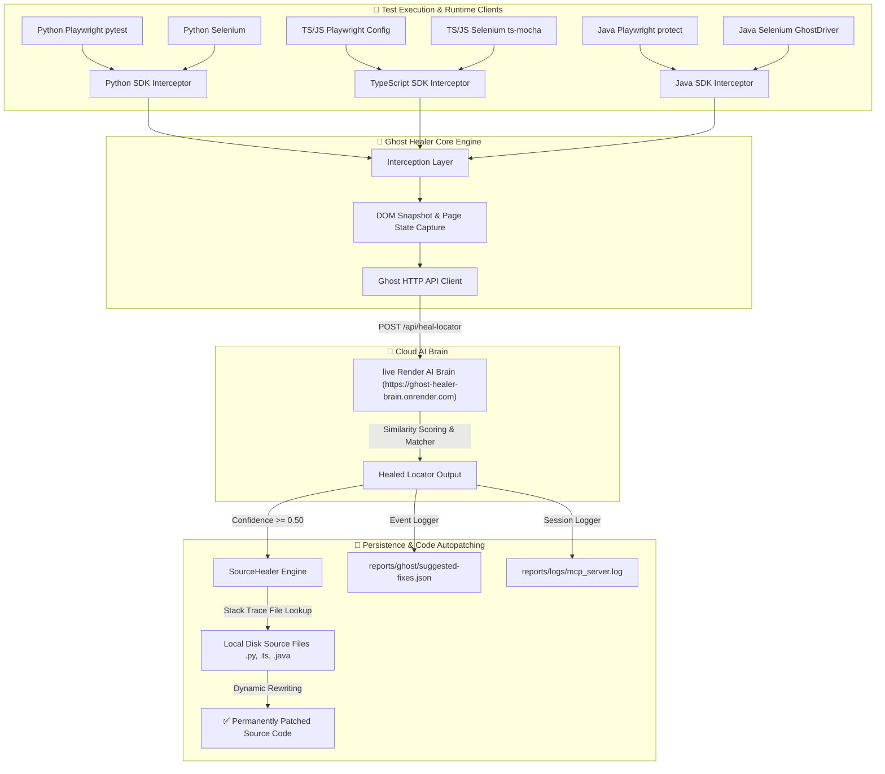

# 👻 Ghost Healer: Universal AI Self-Healing Automation Platform

### **The world's first language-agnostic, zero-refactor AI self-healing automation platform.**

Ghost Healer is a revolutionary, enterprise-ready automation engine that dynamically intercepts locator failures during test execution, consults a centralized AI Brain to identify the corrected elements, and **permanently rewrites your source code** on disk so you never have to maintain or manually repair the same locator again.

---

## 🎨 System Architecture & Project Blueprint

Here is the architectural overview of how Ghost Healer's cross-language adapters, source-healing engine, and AI Brain communicate dynamically:



---

## 📂 Project Structure Blueprint

The repository is modularly organized to support standalone packaging and zero-configuration setups:

```text
MCP_CLIENT_SERVER_PROJECT/
├── ghost_healer/                 # 🐍 Core Python SDK & Adapters
│   ├── core/                     # Configuration and AI interaction layer
│   ├── adapters/                 # Pytest, Playwright, and Selenium interceptors
│   ├── framework/java/           # ☕ Standalone Java SDK (GhostPlaywright, GhostDriver)
│   └── utils/                    # Enhanced Workspace Reporter
│
├── sdk/ts/                       # 🟦 Core TypeScript/JavaScript SDK Package
│   ├── src/                      # TS Setup, Playwright config hooks, Selenium setups
│   └── package.json              # Standalone npm configuration (ghost-healer-ts)
│
├── demo/                         # 🧪 Comprehensive Test Verification Demos
│   ├── playwright-python/        # Zero-code python test examples
│   ├── playwright-ts/            # Zero-code typescript test examples
│   ├── pw-java/                  # Consolidated Maven runner for Java Playwright & Selenium
│   ├── selenium-python/          # Python Selenium demo test suite
│   └── README.md                 # 📚 Ultimate Multi-Language Run & Setup Guide
│
├── reports/                      # 📊 Centralized Reports & Logs Workspace
│   ├── ghost/                    # Healed locator suggested-fixes JSONs
│   └── logs/                     # Full HTTP session debug traces
│
└── pyproject.toml                # Standard python package build file
```

---

## ⚡ Key Features

- **Zero-Refactor Code Integration**: Integrates directly into your existing corporate Page Object Model (POM) frameworks. Your test assertions, actions (`click()`, `fill()`, `sendKeys()`), and page setups remain untouched.
- **Implicit Live AI Brain**: All SDKs and adapters connect implicitly to the live Render AI Brain (`https://ghost-healer-brain.onrender.com`) out of the box. No manual environment variables or local databases are required!
- **Dynamic Source Patching**: Captures active stack traces on failure, walks the file tree, locates the target `.py`, `.ts`, or `.java` source file on your local machine, and **permanently rewrites** the locator string.
- **Unified Workspace Reporting**: Beautifully structures suggested repairs and detailed latency, confidence, and execution traces under `<workspace_root>/reports/ghost/suggested-fixes.json`.

---

## 🚀 Step-by-Step Quick Start Guide

The beauty of Ghost Healer is the minimal setup required.

### 🐍 Python (Playwright & Selenium)
Install the package from the project root:
```bash
pip install .
```
- **Playwright**: Run tests normally. The `pytest` plugin automatically intercepts failures and runs self-healing:
  ```bash
  pytest demo/playwright-python/test_demo.py -v -s
  ```
- **Selenium**: Wraps your driver instance seamlessly:
  ```bash
  python demo/selenium-python/test_demo.py
  ```

---

### ☕ Java (Selenium & Playwright)
All Java adapters are consolidated into a compile-ready Maven project under `demo/pw-java`.
```bash
cd demo/pw-java
```
- **Playwright Java Test**:
  ```bash
  mvn clean test -Dtest=PlaywrightJavaDemo
  ```
- **Selenium Java Test**:
  ```bash
  mvn clean test -Dtest=SeleniumJavaDemo
  ```

---

### 📜 JavaScript / TypeScript (Playwright & Selenium)
Install the TS SDK package:
```bash
# Local install:
npm install sdk/ts
```
- **Playwright**: Add one line to your `playwright.config.ts`.
  ```typescript
  // playwright.config.ts
  globalSetup: require.resolve('ghost-healer-ts/setup')
  ```
- **Selenium**: Add one require statement to your test runner configuration (e.g., Jest or Mocha).
  ```javascript
  // mocha command parameter:
  --require ghost-healer-ts/selenium-setup
  ```

---

## 📊 Enterprise Reporting Structure

After executing any automation run, Ghost Healer implicitly generates logs under the workspace root directory:

### 1. Suggested Fixes Audit Report (`reports/ghost/suggested-fixes.json`)
Consolidated, beautiful JSON records outlining healed locator events:
```json
[
  {
    "timestamp": "2026-05-17T22:00:15.123+05:30",
    "framework": "playwright-ts",
    "language": "typescript",
    "file": "c:/Users/.../demo/playwright-ts/test_demo.spec.ts",
    "line": 40,
    "action": "fill",
    "old_locator": "#user-name-broken",
    "suggested_locator": "#user-name",
    "confidence": 0.985,
    "page_url": "https://www.saucedemo.com/"
  }
]
```

### 2. Active Session Logs (`reports/logs/mcp_server.log`)
Traces of AI execution context, request parameters, DOM parsing durations, and element similarities score matrices.

---

**Built to heal. Designed to scale. Stop fixing locators permanently!** 🛡️🌍🏆✨
