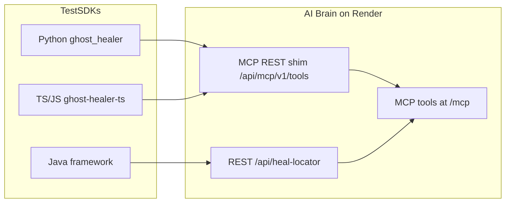

# Ghost Healer: Universal AI Self-Healing Automation Platform

Language-agnostic, zero-refactor self-healing for **Playwright** and **Selenium** across **Python, TypeScript, JavaScript, and Java**. Install an SDK, point tests at the AI Brain, and healing runs without changing test scripts.

For step-by-step demos across all eight language/tool combinations, see [demo/README.md](demo/README.md).

---

## What It Does

- Intercepts locator failures at runtime (no custom locator wrappers in tests).
- Sends DOM snapshots to a centralized **AI Brain** for similarity-based matching.
- Retries failed steps with healed locators when confidence is high enough.
- Optionally patches source files on disk (`runtime` mode).
- Queues fixes for human review (`suggestion` / `approval` modes).
- Records heals in `reports/ghost/` for audit and feedback.

---

## Architecture (MCP-First)



| Layer | Location | Role |
|--------|----------|------|
| SDK / adapters | `ghost_healer/`, `sdk/ts/`, `ghost_healer/framework/java/` | Auto-activation, interceptors, reporting |
| AI Brain | `mcp-server/` | FastAPI + MCP gateway, healing pipeline, storage |
| Config | `ghost.yaml` | Brain URL, thresholds, healing mode, tenant/project |

Default production Brain: `https://ghost-healer-brain.onrender.com`

---

## Supported Matrix

| Language | Playwright | Selenium |
|----------|------------|----------|
| Python | Yes (pytest plugin) | Yes (auto fixture detection) |
| TypeScript | Yes (auto-activate) | Yes (auto-activate) |
| JavaScript | Yes (auto-activate) | Yes (auto-activate) |
| Java | Yes (`demo/pw-java`) | Yes (JUnit 5 + optional javaagent) |

---

## Quick Start (Zero Script Changes)

### 1. Configure `ghost.yaml` (project root)

```yaml
mcp_server:
  url: "https://ghost-healer-brain.onrender.com"
  protocol: "mcp-first"
  confidence_threshold: 0.5
  api_key: ""   # or set GHOST_API_KEY in CI

healing:
  mode: "runtime"    # runtime | suggestion | approval | strict
  auto_patch: true
  cache_enabled: true

reporting:
  output_dir: "reports/ghost"
```

See [docs/ZERO_CHANGE_INSTALL.md](docs/ZERO_CHANGE_INSTALL.md) for per-language install details.

### 2. Install SDK and run tests

**Python**

```bash
pip install .
pytest demo/playwright-python/test_demo.py -v
```

The pytest plugin (`ghost`) auto-wraps `page` and common Selenium fixtures (`driver`, `browser`, `webdriver`).

**TypeScript / JavaScript**

```bash
cd sdk/ts && npm install && npm run build
# In your project:
npm install ghost-healer-ts
npx playwright test
```

`postinstall` sets `NODE_OPTIONS=--require ghost-healer-ts/auto-activate` for zero-config hooks.

**Java**

```bash
cd demo/pw-java
mvn clean test -Dtest=PlaywrightJavaDemo
```

JUnit 5 loads `GhostHealerExtension` via service loader. Optional zero-annotation mode:

```bash
export JAVA_TOOL_OPTIONS="-javaagent:path/to/ghost-healer-agent.jar"
```

### 3. Verify

```bash
ghost-healer doctor
ghost-healer report
ghost-healer review    # pending fixes when not in runtime mode
```

---

## Healing Modes

| Mode | Behavior |
|------|----------|
| `runtime` | Heal + retry; optional auto-patch to source files |
| `suggestion` | Suggest heal; queue to `reports/ghost/pending-fixes.json`; no auto-retry |
| `approval` | Same as suggestion; review via `ghost-healer review` |
| `strict` | Only very high-confidence heals applied |

---

## AI Brain (MCP Server)

Run locally:

```bash
cd mcp-server
pip install -r requirements.txt
python -m uvicorn app.main:app --host 0.0.0.0 --port 8000
```

Key endpoints:

| Endpoint | Purpose |
|----------|---------|
| `GET /health`, `GET /health/ready` | Liveness / readiness |
| `POST /api/heal-locator` | Legacy-compatible heal API |
| `POST /api/mcp/v1/tools/{tool_name}` | MCP tool invocation over REST |
| `/mcp` | Model Context Protocol (Streamable HTTP mount) |
| `POST /api/heal-feedback` | Accept/reject feedback for adaptive scoring |
| `GET /api/pending-fixes` | Human-in-the-loop approval queue |

Deploy with [render.yaml](render.yaml). **Step-by-step:** [docs/DEPLOY_COMPLETE.md](docs/DEPLOY_COMPLETE.md). Set `GHOST_API_KEY` in production.

---

## Project Structure

```text
MCP_CLIENT_SERVER_PROJECT/
├── ghost_healer/           # Python SDK, adapters, pytest plugin, CLI
├── sdk/ts/                 # TypeScript/JavaScript package (ghost-healer-ts)
├── mcp-server/             # AI Brain (FastAPI + MCP)
│   ├── app/main.py
│   ├── mcp_gateway/
│   ├── controllers/
│   └── services/
├── ghost_healer/framework/java/  # Java client + JUnit extension + javaagent
├── demo/                   # Examples for all 8 combinations
├── docs/                   # Migration, zero-change install
├── scripts/                # release_gate.py, verify_slo.py
├── reports/ghost/          # suggested-fixes.json, pending-fixes.json
└── ghost.yaml
```

---

## Development and Release

```bash
# Brain + SDK tests
python -m pytest mcp-server/tests/ tests/ -v

# Staged release gates
python scripts/release_gate.py --stage beta
python scripts/release_gate.py --stage rc
python scripts/release_gate.py --stage ga
```

Docs:

- [docs/MIGRATION_MCP_V1.md](docs/MIGRATION_MCP_V1.md) — upgrade from pre-MCP versions
- [release_checklist.md](release_checklist.md) — Beta / RC / GA gates
- [deployment_guide.md](deployment_guide.md) — Render and distribution

---

## Roadmap

| Feature | Status |
|---------|--------|
| MCP-first Brain + zero-change SDKs | Available |
| Feedback loop and adaptive weights | Available (foundation) |
| Human approval workflow | Available (CLI + pending-fixes API) |
| Multi-modal visual healing | Planned |
| IDE accept/reject plugins | Planned |
| Mobile (Appium) | Research |

---

Stop fixing locators manually — install Ghost Healer and let the Brain heal your suites.
