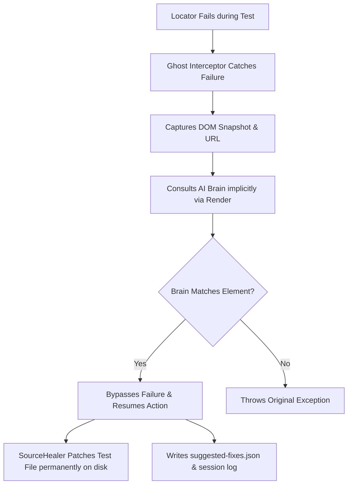

# 👻 Universal Ghost Healer: Multi-Language Integration & Execution Guide

Welcome to the ultimate guide for the **Universal Ghost Healer AI Self-Healing Platform**. This document contains complete, step-by-step instructions, installation commands, code snippets, and configuration steps required to integrate and run the self-healing framework in **any** enterprise Playwright or Selenium automation suite across **Python, Java, TypeScript, and JavaScript**.

---

## 🧠 Architectural Overview

Ghost Healer operates dynamically under the hood to completely eliminate locator maintenance overhead:



- **Zero Test Logic Refactoring**: Your test files, POM (Page Object Model) layers, and assertions remain completely unchanged.
- **Implicit Connectivity**: Out of the box, all SDKs and adapters implicitly query the high-performance live Render Brain (`https://ghost-healer-brain.onrender.com`).
- **Standardized Reports**: Automatically creates and updates `reports/ghost/suggested-fixes.json` under your workspace root directory.

---

## 🐍 1. Python Integration (Playwright & Selenium)

### 📦 SDK Installation
Install the core python package:
```bash
# To install locally from the project root:
pip install -e .

# Or to install via PyPI (if published):
pip install ghost-healer
```

---

### 🎭 A. Python + Playwright Integration
The Python Playwright adapter integrates automatically via `pytest`. No code changes are required in your scripts!

#### Code Example (`test_demo.py`):
```python
def test_saucedemo(page):
    page.goto("https://www.saucedemo.com/")
    
    # Intentionally broken locators will heal dynamically
    page.locator("#user-name-WRONG").fill("standard_user")
    page.locator("#password-WRONG").fill("secret_sauce")
    page.locator("#login-button-WRONG").click()
    
    assert "inventory" in page.url
```

#### Run command:
```bash
pytest demo/playwright-python/test_demo.py -v -s
```

---

### 🌐 B. Python + Selenium Integration
Simply import the `protect_driver` utility and wrap your selenium driver instance immediately after creation.

#### Code Example (`test_demo.py`):
```python
from selenium import webdriver
from selenium.webdriver.common.by import By
from ghost_healer.adapters.selenium import protect_driver

options = webdriver.ChromeOptions()
options.add_argument("--no-sandbox")
driver = webdriver.Chrome(options=options)

# 👻 ONE-LINE ACTIVATION: Intercepts all find_element actions
protect_driver(driver)

driver.get("https://www.saucedemo.com/")
driver.find_element(By.CSS_SELECTOR, "#user-name-WRONG").send_keys("standard_user")
driver.find_element(By.CSS_SELECTOR, "#password-WRONG").send_keys("secret_sauce")
driver.find_element(By.CSS_SELECTOR, "#login-button-WRONG").click()

driver.quit()
```

#### Run command:
```bash
python demo/selenium-python/test_demo.py
```

---

## 🟦 2. TS/JS Integration (Playwright & Selenium)

### 📦 SDK Installation
Install the TypeScript / JavaScript SDK npm package:
```bash
# To install locally from the project:
npm install ../../sdk/ts

# Or to install via NPM:
npm install ghost-healer-ts
```

---

### 🎭 A. TS/JS + Playwright Integration
Simply add a single line to your `playwright.config.ts` or `playwright.config.js` to register the global setup hook.

#### Configuration (`playwright.config.ts`):
```typescript
import { defineConfig } from '@playwright/test';

export default defineConfig({
  // 👻 ONE-LINE ACTIVATION: Patches Playwright Page & Locator prototypes globally
  globalSetup: require.resolve('ghost-healer-ts/setup'),
  use: {
    headless: false,
    screenshot: 'only-on-failure',
  },
});
```

#### Code Example (`test_demo.spec.ts`):
```typescript
import { test, expect } from '@playwright/test';

test('locator API healing works silently', async ({ page }) => {
  await page.goto('https://www.saucedemo.com/');
  
  await page.locator('#user-name-broken').fill('standard_user');
  await page.locator('#password-broken').fill('secret_sauce');
  await page.locator('#login-button-broken').click();
  
  await expect(page).toHaveURL('https://www.saucedemo.com/inventory.html');
});
```

#### Run command:
```bash
cd demo/playwright-ts
npm install
npx playwright test
```

---

### 🌐 B. TS/JS + Selenium Integration
Register the self-healing package via the `--require` flag in your test runner command (Jest, Mocha, etc.).

#### Run command:
```bash
# TS/JS Selenium execution using Mocha:
cd demo/selenium-ts
npm install
npx ts-mocha --require ghost-healer-ts/selenium-setup test_demo.spec.ts
```

---

## ☕ 3. Java Integration (Playwright & Selenium)

### 📦 Drop-In SDK Setup
To integrate with any Maven or Gradle corporate Java project:
1. Copy the three core classes from `ghost_healer/framework/java/` (`GhostPlaywright.java`, `GhostHealerExtension.java`, `GhostDriver.java`) and drop them under the `com.ghosthealer.core` package in your project's `src/main/java` directory.
2. Add the following key dependencies to your `pom.xml`:
```xml
<dependencies>
  <!-- Playwright Java -->
  <dependency>
    <groupId>com.microsoft.playwright</groupId>
    <artifactId>playwright</artifactId>
    <version>1.44.0</version>
  </dependency>
  <!-- Selenium Java -->
  <dependency>
    <groupId>org.seleniumhq.selenium</groupId>
    <artifactId>selenium-java</artifactId>
    <version>4.21.0</version>
  </dependency>
  <!-- Gson (for HTTP parsing) -->
  <dependency>
    <groupId>com.google.code.gson</groupId>
    <artifactId>gson</artifactId>
    <version>2.10.1</version>
  </dependency>
</dependencies>
```

---

### 🎭 A. Java + Playwright Integration
Simply wrap the native Playwright `Page` instance in the base test setup using `GhostPlaywright.protect()`.

#### Code Example (`PlaywrightJavaDemo.java`):
```java
package demo;

import com.microsoft.playwright.*;
import com.ghosthealer.core.GhostPlaywright;
import org.junit.jupiter.api.*;

public class PlaywrightJavaDemo {
    Page page;

    @BeforeEach
    void setUp() {
        Playwright playwright = Playwright.create();
        Browser browser = playwright.chromium().launch(new BrowserType.LaunchOptions().setHeadless(false));
        BrowserContext context = browser.newContext();
        
        // 👻 ONE-LINE ACTIVATION: Wraps page with a self-healing proxy
        page = GhostPlaywright.protect(context.newPage());
    }

    @Test
    void testPlaywrightHealing() {
        page.navigate("https://www.saucedemo.com/");
        page.locator("#user-name-WRONG").fill("standard_user");
        page.locator("#password-WRONG").fill("secret_sauce");
        page.locator("#login-button-WRONG").click();
    }
}
```

#### Run command:
```bash
cd demo/pw-java
mvn clean test -Dtest=PlaywrightJavaDemo
```

---

### 🌐 B. Java + Selenium Integration
Extend your selenium BaseTest with `GhostHealerExtension.class` and annotate the driver field with `@GhostDriver`.

#### Code Example (`SeleniumJavaDemo.java`):
```java
package demo;

import com.ghosthealer.core.*;
import org.junit.jupiter.api.*;
import org.junit.jupiter.api.extension.ExtendWith;
import org.openqa.selenium.*;
import org.openqa.selenium.chrome.ChromeDriver;

@ExtendWith(GhostHealerExtension.class) // 👻 ACTIVATION STEP 1
public class SeleniumJavaDemo {

    @GhostDriver // 👻 ACTIVATION STEP 2
    protected WebDriver driver;

    @BeforeEach
    void setUp() {
        driver = new ChromeDriver();
    }

    @Test
    void testSeleniumHealing() {
        driver.get("https://www.saucedemo.com/");
        driver.findElement(By.id("user-name-WRONG")).sendKeys("standard_user");
        driver.findElement(By.id("password-WRONG")).sendKeys("secret_sauce");
        driver.findElement(By.id("login-button-WRONG")).click();
    }

    @AfterEach
    void tearDown() {
        if (driver != null) driver.quit();
    }
}
```

#### Run command:
```bash
cd demo/pw-java
mvn clean test -Dtest=SeleniumJavaDemo
```

---

## 📊 Reports & Logs Output Structure

After executing any self-healing automation run, Ghost Healer implicitly generates logs under the workspace root directory:

### 1. Suggested Fixes Audit Report (`reports/ghost/suggested-fixes.json`)
Consolidated, beautiful JSON records outlining healed locator events:
```json
[
  {
    "timestamp": "2026-05-17T22:00:15.123+05:30",
    "framework": "playwright-ts",
    "language": "typescript",
    "file": "c:/Users/.../demo/playwright-ts/test_demo.spec.ts",
    "line": 40,
    "action": "fill",
    "old_locator": "#user-name-broken",
    "suggested_locator": "#user-name",
    "confidence": 0.985,
    "page_url": "https://www.saucedemo.com/"
  }
]
```

### 2. Active Session Logs (`reports/logs/mcp_server.log`)
Traces of AI execution context, request parameters, DOM parsing durations, and element similarities score matrices.

---

**Built to heal. Designed to scale. Stop fixing locators permanently!** 🛡️🌍🏆✨
